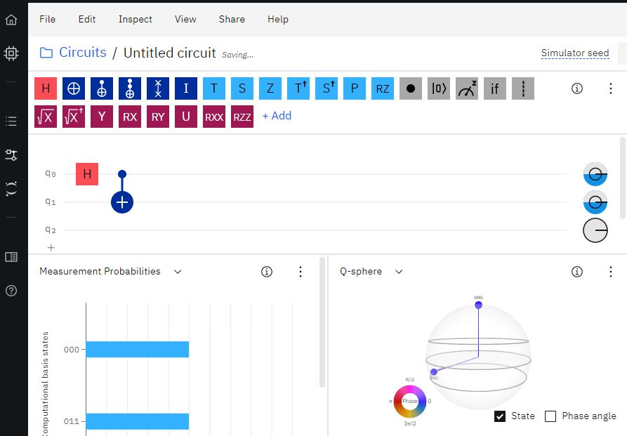
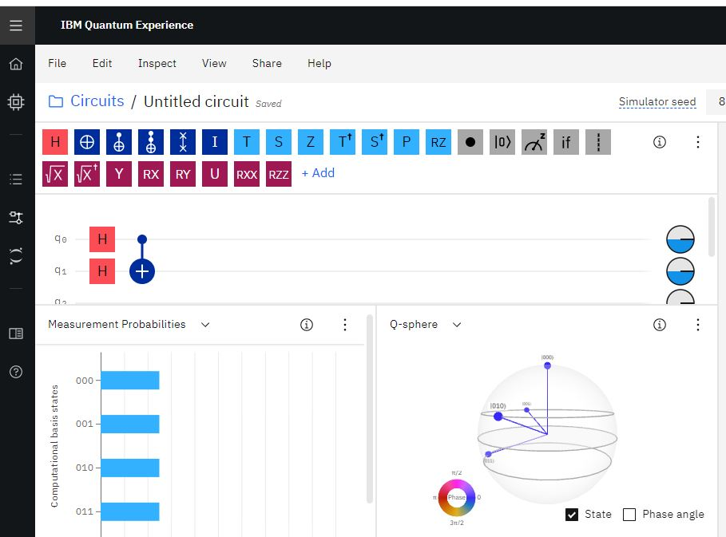
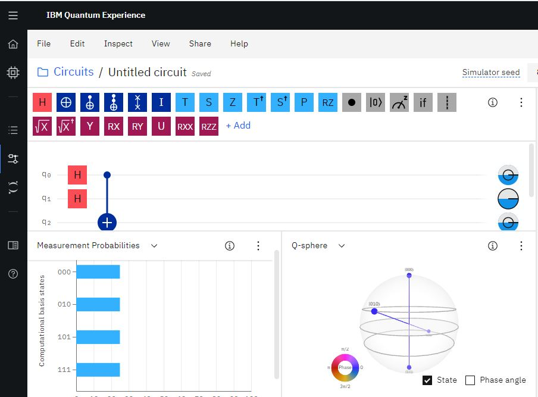
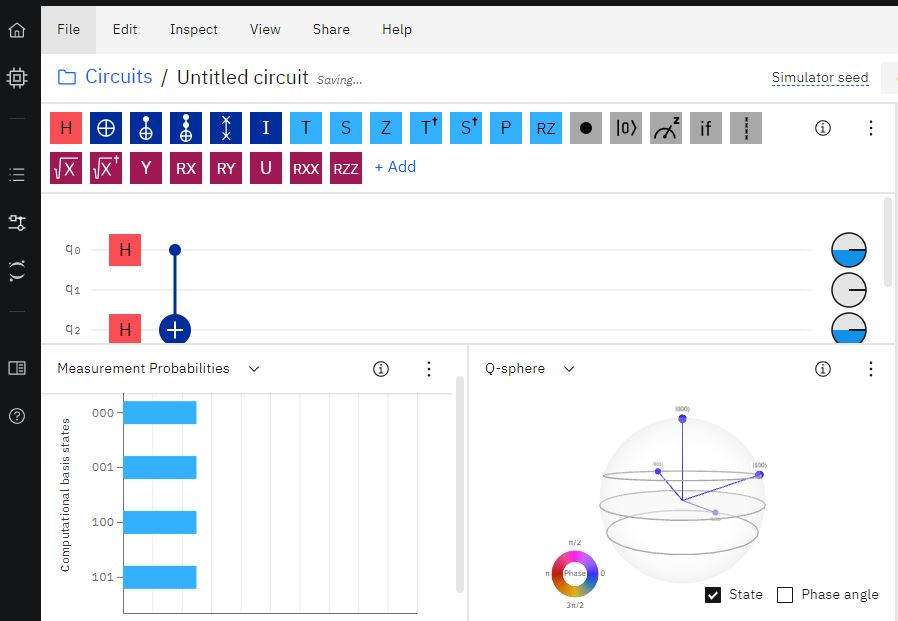
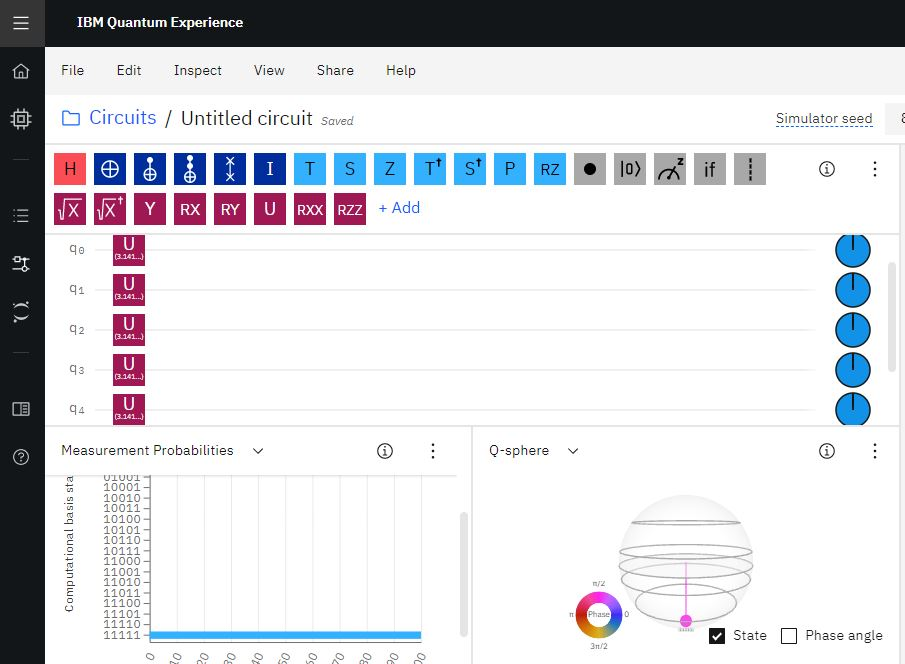

# Basic_quantum_simulator

<h2> Overview </h2>

<p>The project focusses on building a simulator for quantum computing based on the principles of quantum mechanics similar to IBM Qiskit. The simulator is capable of performing
Hadamard gate, CNOT gate and various other unitary gates on the qubits. The Unitary gates are described based on the value of theta,lambda and phi. The Hadamard and CNOT gate is
predefined in the simulator.</p>

<p>There are two versions of the simulator here. The Big_Endian.py uses the Big Endian format to describe the qubits which assigns 0 to MSB and increase towards LSB. The final.py
uses Little Endian format to describe the qubits where 0 is assigned to LSB and increases towards MSB </p>

<h2> Approach Used in design </h2>

<p> The initial approach was to take kronecker product of the gates on the targets bits and the identity for non target bits. This approach is implemented in classic.py.</p>

<h4> Example </h4>
<p> Suppose if we need to implement Hadamard gate operation on the 0th bit in a 2 qubit system, We first take the kronecker product Hadamard matrix for the zeroth bit and the Identity for second bit as no operations is performed for second bit. Conversely if we want to perform Hadamard to second qubit we take kronecker of identity matrix signifying no operations for the first qubit and Hadamard matrix for second qubit.</p>

<h5> Kronecker Product </h5>


<h5> Hadamard for first qubit example </h5>


<h4> State Repressentation </h4>

<p> Here as a basic example we use tow qubit system and it has 4 states 00,01,10,11. We represent the inital state which is of 00 in the form of a matrix so that we can directly multiply with our Hadamard gate through matrix multiplication. We use kronecker product to do so. </p>

<p> Since 0 = [1 0] and 1 = [0 1] we can denote the four states as below </p>

<UL>
  <LI> 00 => [1 0] Kronecker [1 0] </LI>
  <LI> 01 => [1 0] Kronecker [0 1] </LI>
  <LI> 10 => [0 1] Kronecker [1 0] </LI>
  <LI> 11 => [0 1] Kronecker [0 1] </LI>
</UL>

<p>such that their amplitudes sum up to 1.</p>

<p> [ 1 0 0 0 ] for state 0,0 </p>
<p> [ 0 1 0 0 ] for state 0,1 </p>
<p> [ 0 0 1 0 ] for state 1,0 </p>
<p> [ 0 0 0 1 ] for state 1,1 </p>

<p> Now the result of the Hadamard operation can be directly obtained by the matrix multiplication by Hadamard matrix which is kronecker with identity and the state matrix </p>


<h2> Modified approach </h2>

<p> The previous approach has drawbacks on extending the higher bits as there is not much flexibility in describing operations especially CNOT in this case. We don't have am implementation if we want to apply CNOT for first and third bit and leave second bit uninterrupted. Since both target qubits are adjacent the previous approach won't work. So we try a different approach in generating the matrix.</p>

<p> For each gate single qubit gate we can directly create a matrix of 2x2. But the implementation for 2 qubit gates are changed to prvoide the mentioned flexibility.For example CNOT gate has a control and target bits which can be in any position. So instead of predefining the matrix we just store the location of control and target bits. Now we iterate through each comnibation of bits (2^n combinations for n qubit system) and find out the binary representation. Now we iterate through the representation and apply Kronecker product as below </p>

<h4> Applying Hadamard to second bit </h4>

<h5> For 000 we get</h5>


<h5> Applying CNOT to first and third qubit with first qubit being the control and third being target </h5>


<p> CNOT gate:
[ 1, 0, 0, 0, 0, 0, 0, 0 ]
[ 0, 1, 0, 0, 0, 0, 0, 0 ]
[ 0, 0, 1, 0, 0, 0, 0, 0 ]
[ 0, 0, 0, 1, 0, 0, 0, 0 ]
[ 0, 0, 0, 0, 0, 1, 0, 0 ]
[ 0, 0, 0, 0, 1, 0, 0, 0 ]
[ 0, 0, 0, 0, 0, 0, 0, 1 ]
[ 0, 0, 0, 0, 0, 0, 1, 0 ] </p>

<p> This method provide flexibility in this way and is better than the classical approach </p>

<h2> Measurement </h2>

<p> Now after applying the gates to our initial state, we get the weight vector of states. We use choices function from random library to sample the bits based on the weights vector. In our simulator we perform the above measurement 1000 times and get the results.<p>


<h2> Implementation </h2>

```
Run final.py after setting the circuit as JSON format

```
<p> The simulator uses JSON format to set the circuit as below. First we decide the number of qubits to use and set them to ground state. Then we pass the circuit and make measurement. </p>

```
my_qpu = get_ground_state(2) #setting number of qubits

my_circuit = [
{ "gate": "h", "target": [0,1] },
#first bit is control and second is target 
{ "gate": "cx", "target": [0,2] }
]

```
<p>This is similar to the below circuit.Since we use little Endian format which is same as IBM Qiskit Implementation we can directy test our implementation with that of IBM Qiskit.</p>

<h2> Results </h2>

<h4> Example 1 </h4>



<h4> Our simulator Output </h4>

```
my_circuit = [
{ "gate": "h", "target": [0] },
#first bit is control and second is target 
{ "gate": "cx", "target": [0,1] }
]

O/P

Qubit state
[1 0 0 0]
Output
{'00': 481.0, '01': 0.0, '10': 0.0, '11': 519.0}

```

<h4> Example 2 </h4>



<h4> Our simulator Output </h4>

```
my_circuit = [
{ "gate": "h", "target": [0,1] },
#first bit is control and second is target 
{ "gate": "cx", "target": [0,1] }
]

Qubit state
[1 0 0 0]
Output
{'00': 241.0, '01': 261.0, '10': 255.0, '11': 243.0}

```

<h4> Example 3 </h4>


<h4> Our simulator Output </h4>

```
my_circuit = [
{ "gate": "h", "target": [0] },
#first bit is control and second is target 
{ "gate": "cx", "target": [0,2] }
]


Qubit state
[1 0 0 0 0 0 0 0]
Output
{'000': 509.0, '001': 0.0, '010': 0.0, '011': 0.0, '100': 0.0, '101': 491.0, '110': 0.0, '111': 0.0}

```

<h4> Example 4 </h4>



<h4> Our simulator Output </h4>

```
my_circuit = [
{ "gate": "h", "target": [0,1] },
#first bit is control and second is target 
{ "gate": "cx", "target": [0,2] }
]

Qubit state
[1 0 0 0 0 0 0 0]
Output
{'000': 255.0, '001': 0.0, '010': 263.0, '011': 0.0, '100': 0.0, '101': 235.0, '110': 0.0, '111': 247.0}

```

<h4> Example 5 </h4>



<h4> Our simulator Output </h4>

```
my_circuit = [
{ "gate": "h", "target": [0,2] },
#first bit is control and second is target 
{ "gate": "cx", "target": [0,2] }
]

Qubit state
[1 0 0 0 0 0 0 0]
Output
{'000': 251.0, '001': 270.0, '010': 0.0, '011': 0.0, '100': 254.0, '101': 225.0, '110': 0.0, '111': 0.0}

```

<h4> Example 6 </h4>



<h4> Our simulator Output </h4>

```
my_circuit= [
  { "gate": "u3", "params": { "theta": 3.1415, "phi": 1.5708, "lambda": -3.1415 }, "target": [0,1,2,3,4] }
]

Qubit state
[1 0 0 0 0 0 0 0 0 0 0 0 0 0 0 0 0 0 0 0 0 0 0 0 0 0 0 0 0 0 0 0]
Output
{'00000': 0.0, '00001': 0.0, '00010': 0.0, '00011': 0.0, '00100': 0.0, '00101': 0.0, '00110': 0.0, '00111': 0.0, '01000': 0.0, '01001': 0.0, '01010': 0.0, '01011': 0.0, '01100': 0.0, '01101': 0.0, '01110': 0.0, '01111': 0.0, '10000': 0.0, '10001': 0.0, '10010': 0.0, '10011': 0.0, '10100': 0.0, '10101': 0.0, '10110': 0.0, '10111': 0.0, '11000': 0.0, '11001': 0.0, '11010': 0.0, '11011': 0.0, '11100': 0.0, '11101': 0.0, '11110': 0.0, '11111': 1000.0}

```


